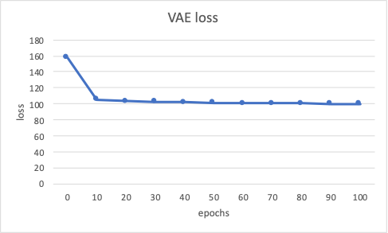
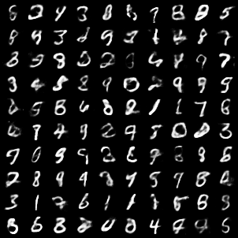
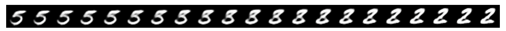
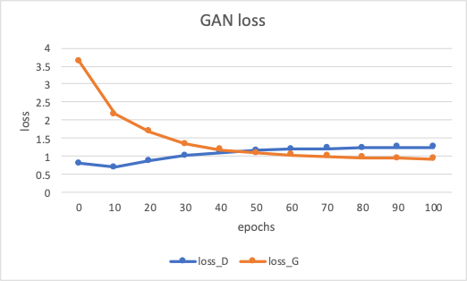
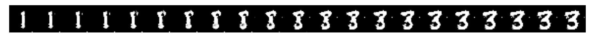

# Comparsion Studying on GAN and VAE

### [Link to PDF report](Final_report.pdf)

This report and code is for project of CAP 6610, Machine Learning, Fall 2020

## Code 
I train and test the model in Python Jupyter NoteBook, with PyTorch Framework. I train each network for 100 epochs. Meanwhile, I do a distributation pertubation Test on each model.

[code for GAN](GAN/GAN.ipynb)

[code for VAE](VAE/vae.ipynb)

#### Environment requirement
- Python 3.7.4
- pytorch 1.6.0
- torchvision 0.7.0
- numpy 1.17.2
- jupyter 1.0.0
- ipython 7.8.0

## Abstract
Generative model is one of the hottest topic today in Machine Learning. This paper studies and comparies the 2 famous generative model: GAN and VAE, and give out further analysis about their differences and performances. VAE is a improved autoencoder model which force encoder learns the mapping from images to some latent distribution parameters space, Then, the input to the decoder is some generated random noise with same distribution to the latent parameters. Then decoder learns the mapping from the distribution to images. However, GAN is different. The generator will try to learn the mapping from simple random low-dimension noise to images. Then generator play the minimax game with discriminator in order to improve.

## VAE

#### Result images

#### Pertubation Test

## GAN

#### Result images

#### Pertubation Test

## Comparsion

1. For the latent space, the latent space of VAE is obtained from encoder, however, the latent space is simple low-dimension random noise.
2. For the ideas, the core idea of VAE is learn latent distribution inside images; however, the core idea of GAN is compete the minimax game.
3. For architecture, The VAE is consist of encoder and decoder, but the GAN is consist of generator and discriminator.
4. From my human-eye point of view, the overall quality of GAN is better than VAE. The images of VAE is more smooth, but the some images looks more weird. Although some images of GAN contains white dot noises, it looks more like numbers.
5. The training of VAE is simpler than GAN, it converge much faster. The Generator of GAN converge pretty slow.

## References

1. Goodfellow, Ian, Jean Pouget-Abadie, Mehdi Mirza, Bing Xu, David Warde-Farley, Sherjil Ozair, Aaron Courville, and Yoshua Bengio. "Generative adversarial nets." In Advances in neural information processing systems, pp. 2672-2680. 2014.
2. Kingma, Diederik P., and Max Welling. "Auto-encoding variational bayes." arXiv preprint arXiv:1312.6114 (2013).
3. Goodfellow, Ian. "NIPS 2016 tutorial: Generative adversarial networks." arXiv preprint arXiv:1701.00160 (2016).
1. Paszke, Adam, Sam Gross, Francisco Massa, Adam Lerer, James Bradbury, Gregory Chanan, Trevor Killeen et al. "Pytorch: An imperative style, high-performance deep learning library." In Advances in neural information processing systems, pp. 8026-8037. 2019.
1. Ketkar, Nikhil. "Introduction to pytorch." In Deep learning with python, pp. 195-208. Apress, Berkeley, CA, 2017.
1. Amini, Alexander. "Introduction to deep learning." MIT 6 (2019): S191.
1. Linder-Norén, E., PyTorch-GAN, 2019, GitHub repository, https://github.com/eriklindernoren/PyTorch-GAN
1. Lee, A., pytorch-mnist-GAN, 2018, GitHub repository, https://github.com/lyeoni/pytorch-mnist-GAN
1. pytorch, examples, 2020, GitHub repository, https://github.com/pytorch/examples

